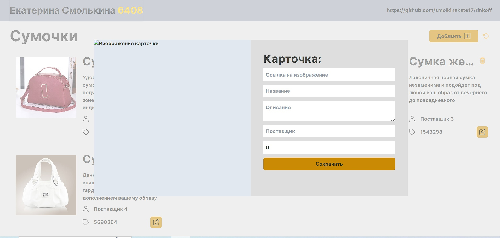

# tinkoff
Главное окно 

 
Окно добавления/редактирования 

 
Инструкция: 
1. Зайти в папку с проектом  
2. Открыть консоль 
3. Прописать команду"npm i", чтобы установить все нужные модули 
4. Запустить локальный сервер командой "npm run dev"

